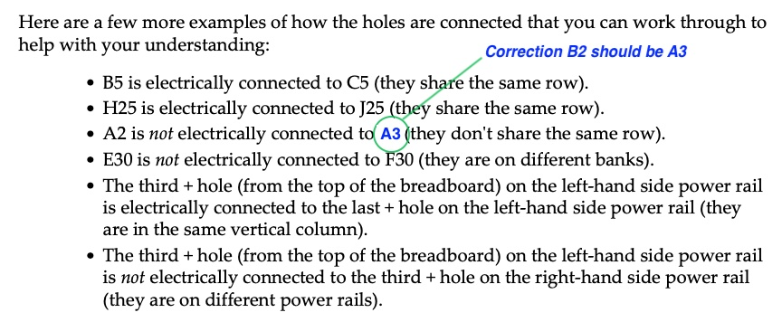

# Chapter Errata

This page contains corrections and clarifications to the content found in the published book.

## Chapter 2 - Understanding the breadboard

Page 44 printed 1st edition; Page 42 PDF 1st edition.



---

## Chapter 2 - Responding to a button press with PiGPIO

Page 67 printed 1st edition; Page 65 PDF 1st edition.


Under the sub heading **Button pin configuration**, we see a snippet of code from the file `chapter02/button_pigpio.py`

At line 3 `set_glitch_filter` has the parameter 10000, which is the debounce time measured in __microseconds__.

The proceeding paragraph states the value is in __milliseconds__, which is incorrect.

In this example, the timeout is therefore 10000 / 1000000 = 0.01 seconds

This difference in timing value is not expected to affect the reader's ability to complete the exercise. However, should the example behave erratically when the button is pressed, the reader should change the parameter at line 3 from `10000` to `100000` to make the debounce time 0.1 seconds. The corrected line will therefore be:

```
pi.set_glitch_filter(BUTTON_GPIO_PIN, 100000)         # (3)
```

---

## Chapter 2 - poll_dweets_forever() function

Page 74 printed 1st edition; Page 72 PDF 1st edition.


There is a 4 space indentation missing in the code example for the function `poll_dweets_forever()` at line 13. The effect of this means the statement `sleep(delay_secs)` is outside the `while` block and the loop never incurs the delay. 

This error does not affect a readers ability to successfully run the example, but it does make the paragraph (as pictured above) practically incorrect as the code does not incur the 2-second delay at line 13.
